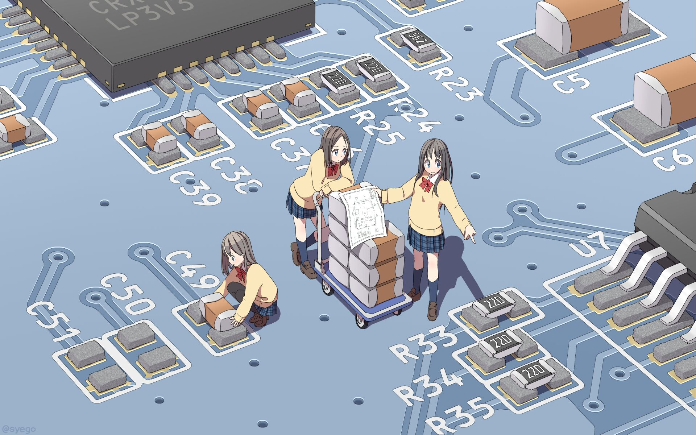

  <h1>こんにちは～(∠・ω< )⌒☆</h1>

- 🏫 大学院生 at the [**九大芸術工学**](https://www.design.kyushu-u.ac.jp/) of the [**Kyushu University**](https://www.kyushu-u.ac.jp/ja/) & 卒業した学部 [**上海大学情報システム部**](http://cs.shu.edu.cn.)
- 💬 English & 日本語 are available.
- 🔭 Researching on [**Style Transfering**](https://en.wikipedia.org/wiki/Neural_style_transfer) & [**Gaussian Splatting**](https://github.com/graphdeco-inria/gaussian-splatting)
- 💻 Mac & Ubuntu
- 📫 How to reach me [**chouyuduki@gmail.com**](mailto:chouyuduki@gmail.com)
- [**My HomePage**](https://chouyuduki.github.io/)
&nbsp; 
&nbsp; 

<!--
**ChouYuduki/ChouYuduki** is a ✨ _special_ ✨ repository because its `README.md` (this file) appears on your GitHub profile.

Here are some ideas to get you started:

- 🔭 I’m currently working on ...
- 🌱 I’m currently learning ...
- 👯 I’m looking to collaborate on ...
- 🤔 I’m looking for help with ...
- 💬 Ask me about ...
- 📫 How to reach me: ...
- 😄 Pronouns: ...
- ⚡ Fun fact: ...
-->
